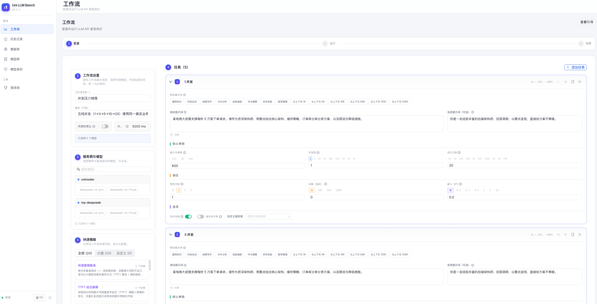
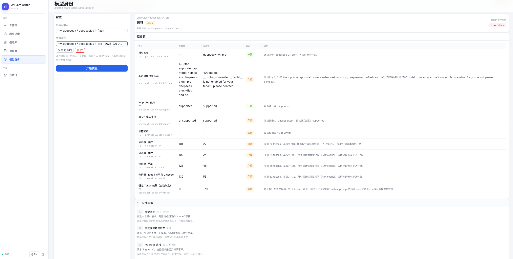
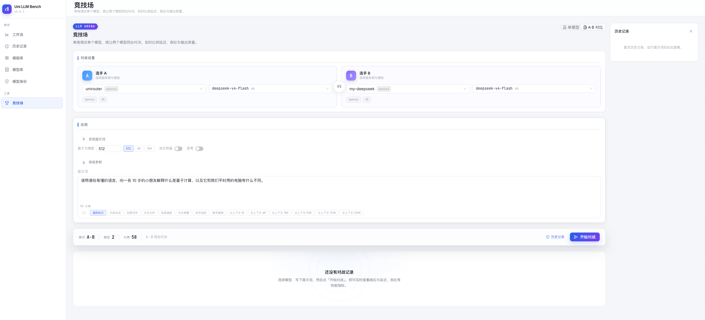
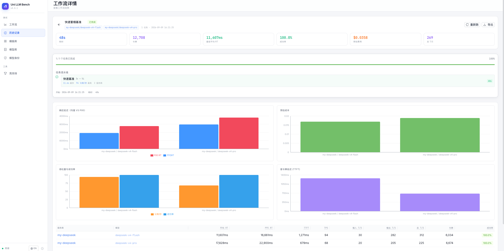
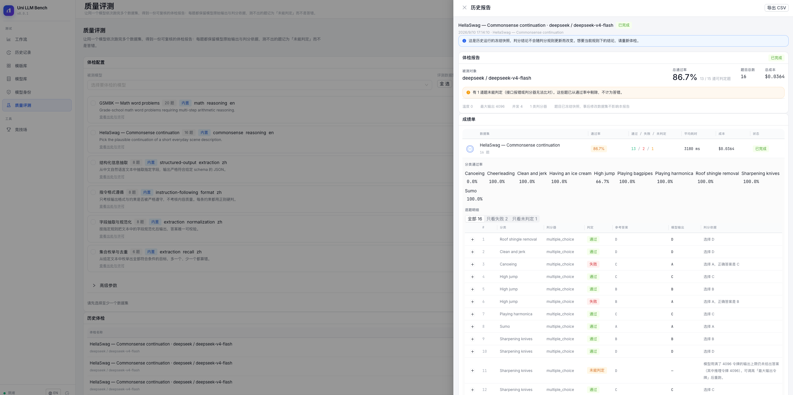

# Uni LLM Bench

[English](README-en.md) | **中文**

**自托管的轻量化 LLM API 基准测试平台 —— 模型指纹对比 + 模型质量评测。**

在你自己的内网环境里对任意 OpenAI 兼容端点做压测，用指纹对比核验端点背后究竟是不是它声称的那个模型，再用确定性判分器评测它答得对不对。单 Node.js 进程 + 单 SQLite 文件，不依赖任何外部服务。

---

## 核心定位

| 关键词 | 一句话 |
|---|---|
| 🏠 **本地化** | 全栈跑在你自己的机器上：无 Redis、无 Postgres、无任何遥测上报，应用本身零外部依赖，可部署在隔离内网 |
| 🪶 **轻量化** | 单 Node.js 进程 + 单 SQLite 文件，一行脚本或 Docker Compose 即可起，备份就是复制那一个文件 |
| 🕵️ **模型指纹对比** | 10 个指纹探针分两层采集，与可信基线逐项比对，在硬性判据下给出「一致 / 可疑 / 不匹配」的确定结论 |
| 🧭 **模型质量评测** | 7 个确定性判分器 + 6 个内置数据集（66 题），在「跑得多快、多贵」之外回答「答得对不对」 |
---

## 为什么选择 Uni LLM Bench？

Uni LLM Bench 把"可信"做成出厂默认，而不是一个需要你事后校验的开关：

- **数字不撒谎** — API 一旦出错就如实抛出，绝不用一段"看着合理"的模拟数据把报告补满；测不出来的指标就留空，绝不拿系数硬凑。你看到的每一毫秒、每一分钱，都是真跑出来的。
- **模型指纹对比** —「模型身份」用协议层 + 分词器层共 10 个指纹探针做基线比对，给你一个不含糊的"是 / 否"，而不是一个可以各执一词的相似度分数。
- **模型质量评测** — 7 个确定性判分器全部本地执行、零成本、可复现；判不了的题如实标为「未能判定」，绝不记成答错。
- **跑之前就心里有数** — 配一次模型单价，每个工作流在按下"开始"之前就给出成本预估（连缓存命中的省钱效果都算进去），不再事后被账单吓一跳。
- **本地化 + 轻量化** — 单进程 + 单文件数据库，没有 Redis、没有 Postgres、没有任何遥测上报。数据留在你自己的机器上，架构简单到出错时你有底气自己修。

---

## 特色亮点

| | |
|---|---|
| 🔬 **测量可信度** | 每个数值真实可溯：失败即报错、绝不留模拟值、测不出就显 N/A、重试计入延迟、错误结构化归类 |
| 🧪 **工作流引擎** | 多任务串行压测，每个任务独立的提示词 / 并发（1–5000）/ 迭代（1–10M），支持预热 |
| 💰 **成本预估** | 按模型配置每百万 token 单价，含缓存读档位，运行前即可看到预估成本 |
| 📚 **模板库** | 20 个内置模板 + 自定义模板的完整增删改查，持久化存储 |
| ⚔️ **竞技场** | 两个服务商/模型同题对决，流式并排对比响应 |
| 🎨 **零依赖引导体验** | 自研聚光灯式分步引导、跟随状态的工作流步骤条、中英双语 |

---

## 功能

### 工作流引擎

- 多任务串行执行，每个任务可单独配置提示词、并发数与迭代次数
- 并发 1–5000、迭代 1–10M、预热 0–5 次、最大令牌 50–32000
- 任务间隔冷却、间隔随机抖动、全局 QPS 令牌桶
- 可设定前缀缓存命中率，让缓存行为可复现而不是碰运气
- 失败即停、按任务覆盖服务商选择
- SSE 实时进度：跑起来之后可以切到别的页面，进度实时同步回来

### 模型指纹对比（模型身份核验）

这个模块**不问标签，直接给端点做指纹，再与基线逐项比对**——结论落在确定的是 / 否上。

- **T0 · 协议层探针** — 模型名回显、非法模型错误形态、logprobs 支持、JSON 模式支持、前缀缓存回放检测
- **T1 · 分词器探针** — 端点如何切分固定探针文本（英文 / 中文 / 代码 / emoji）会暴露底层分词器
- **基线机制** — 先采集一个你信任的端点（最好是厂商官方 API）的指纹，所有核验都相对基线而言
- **硬性判据** — 结论为 `一致` / `可疑` / `不匹配` / `无法确定` / `出错`；一条致命信号优先于任何加权得分
- **证据表** — 每个探针都列出基线值与实测值，结论你自己可以复核

### 模型质量评测

回答第三个问题——**答得对不对**。与性能基准（跑得多快多贵）、模型指纹对比（是不是它自称的模型）互补，三者共同构成完整的模型评估闭环。

- **7 个确定性判分器** — 完全匹配、包含关键词、正则格式、数值容差、JSON Schema、选择题、集合匹配。全部本地执行、零成本、完全可复现
- **能用规则判的题绝不调用裁判模型** — 裁判既是开销也是偏见来源，只在主观题上才值得动用（L2 计划中）
- **内置 6 个数据集共 66 题** — GSM8K（数学推理，MIT）与 HellaSwag（常识续写，MIT）取自上游原始题目；另有 4 个自建数据集覆盖结构化抽取、指令格式遵循、字段规范化、集合枚举
- **测不出绝不记为答错** — 接口报错或判分器无法比对时，该题记为「未能判定」并从通过率分母中剔除；一道题都判不出时通过率显示「无法判定」，而不是 0%
- **逐题可复核** — 每题保留模型原始输出、参考答案、命中的判分规则与证据值，可按「只看失败 / 只看未判定」筛选下钻
- **冻结快照** — 运行时固化题目，事后修改数据集不会改写历史报告
- **测量前提写进报告** — 温度、最大输出、并发数、判分器构成在报告顶部披露；默认温度 0 且非流式，保证可复现
- **JSONL / CSV 导入** — 导入前逐行校验并给出行号级报告，不合格的行不会被静默接受

| 指标 | 说明 |
| --- | --- |
| 通过率 | pass / (pass + fail)，不可判定题不计入分母 |
| 分类通过率 | 按题型拆分，暴露能力短板 |
| 未判定数 | 接口错误或无法比对的题数，与通过率并列展示而非藏在角落 |
| 平均耗时 / 成本 | 复用既有统计口径，只统计真正拿到响应的样本 |

### 模型库

- 统一管理服务商与模型：端点、API 密钥（加密存储）、模型能力
- 四种格式：OpenAI、Anthropic、Google Gemini，以及通用 OpenAI 兼容（DeepSeek、Mistral、Ollama、vLLM 等）
- 可选填写模型单价（输入 / 输出 / 缓存读 / 缓存写，每百万 token），驱动成本预估
- 支持「测试连接」验证配置

### 模板库

- 20 个内置模板，随库播撒：冒烟测试、TTFT 延迟画像、输出吞吐梯度与并发阶梯、流式对比批处理、
  长上下文吞吐、成本效益审计、可靠性与稳定性，以及贴近真实业务的负载混合（知识问答、长文摘要、
  代码生成、信息抽取、函数调用与结构化输出、创意写作、文本翻译、多轮对话、中文 RAG 与抗幻觉、
  数学推理、多模态视觉基准、真实流量混合）
- 自定义模板完整 CRUD 并持久化
- 一键把模板载入工作流表单

### 竞技场

- 两个服务商/模型用同一条提示词同台对比，响应并排展示
- 流式与非流式两种模式，支持图片 URL 或上传以测试多模态模型
- 每次请求展示 token 计数、TTFT、每秒 Token 数与响应时间；历史记录保留在侧边栏

### 历史记录与导出

- 全量持久化运行历史与完整结果明细
- 多轮结果并排对比、逐条下钻
- 导出为 JSON 或 CSV

### 认证与安全

- JWT 登录，凭据可配置；首次登录强制修改密码
- JWT / 加密密钥 / 加密盐自动生成并持久化，不使用硬编码默认值
- 登录限流（5 次 / 5 分钟）、Helmet 安全头与 CSP
- SSE 与下载链接使用一次性 token，JWT 不出现在 query string
- token 存于 `sessionStorage`，关闭标签页即清除
- CORS 仅限配置的来源（默认同源）

### 国际化与上手引导

- 完整的中英双语界面
- 零依赖的聚光灯式分步引导（基于 `data-tour` 锚点），首次进入自动弹出，各页面可随时重开
- 工作流步骤条（配置 → 运行 → 结果）跟随真实运行状态自动推进

---

## 测量可信度

核心设计目标是消灭"测量工具返回不可信数据"这一致命缺陷。以下是已经落地的保证，其中多条由契约测试结构性锁死：

| 保证 | 具体含义 |
|---|---|
| **没有模拟数据回退** | 所有 `simulateResponse()` / `simulateLatency()` 已删除。provider 报错就抛错，绝不会变成"成功"的结果。契约测试断言 `executeWithRetry` 在 provider 抛错时**必须** reject。 |
| **TTFT 不编造** | 非流式响应返回 `firstTokenLatency: null`，不再用 `响应时间 × 0.3` 硬算，界面显示 N/A。 |
| **分位数线性插值** | P50/P95/P99 采用线性插值，小样本下 P95 不再塌缩成最大值。 |
| **吞吐口径诚实** | `avgTokensPerSecond` 按成功样本的总墙钟时间计算，而不是"比值的平均值"（后者会系统性高估）。 |
| **披露离散度** | 每次运行都带 `stdDevResponseTime` 与 `cvResponseTime`（变异系数）。 |
| **重试计入** | 记录重试次数与含退避等待的 `e2eTime`；汇总暴露 `retryRate` 与 `hasRetries`。 |
| **错误结构化分类** | 优先按 HTTP 状态码 / provider 错误码分类，字符串匹配仅作兜底——因此 429 会重试而 4xx 不会。 |
| **定价唯一来源** | 统一由定价模块（每百万单价、缓存档位、最长前缀匹配）供数，适配器里没有散落的魔法数字。 |
| **有界且可恢复** | 列表接口分页（默认 200，上限 500）；启动时与优雅退出时把遗留的 `running` 任务修正为 `interrupted`。 |

---

## 指标

| 指标 | 说明 |
| --- | --- |
| 响应时间 | 平均值 / P50 / P95 / P99（线性插值） |
| 标准差 / 变异系数 | 标准偏差与变异系数 |
| Token 速度 | 输入、输出 token 每秒（按墙钟时间聚合） |
| TTFT | 首 Token 延迟——仅流式可得，否则显示 N/A |
| 吞吐 | 并发压力下的请求数/秒 |
| 成功率 | 成功与失败请求占比，并给出 `retryRate` |
| 成本预估 | 基于配置单价的按模型成本拆分，含缓存档位 |
| 质量通过率 | 数据集驱动的逐题判分，不可判定题不计入分母（见「模型质量评测」） |

---

## 界面截图

<table>
  <tr>
    <td align="center"><b>工作流 — 配置与运行</b></td>
    <td align="center"><b>模型指纹对比 — 核验</b></td>
  </tr>
  <tr>
    <td></td>
    <td></td>  </tr>
  <tr>
    <td align="center"><b>竞技场 — 同题对决</b></td>
    <td align="center"><b>运行详情 — 图表</b></td>
  </tr>
  <tr>
    <td></td>
    <td></td>
  </tr>
  <tr>
    <td align="center"><b>模型质量评测 — 模型体检</b></td>
  </tr>
  <tr>
    <td></td>
  </tr>
</table>

## 快速开始

**本地化 + 轻量化**最直接的好处是启动前没有任何前置条件：不需要 Redis、不需要 Postgres、不需要对象存储，
也不需要向任何第三方注册。只要 Node.js 20+（或 Docker），几步之内就能在自己机器上得到一个完整平台。

### 方式一：一键脚本（生产）

```bash
git clone https://github.com/zj-unicom-ai/uni-llm-bench.git
cd uni-llm-bench
cp .env.example .env    # 编辑 .env 设置凭据
chmod +x start.sh && ./start.sh
```

### 方式二：Docker Compose（生产）

```bash
git clone https://github.com/zj-unicom-ai/uni-llm-bench.git
cd uni-llm-bench
cp .env.example .env    # 编辑 .env 设置凭据
docker compose up -d
```

### 方式三：开发模式

```bash
git clone https://github.com/zj-unicom-ai/uni-llm-bench.git
cd uni-llm-bench
cp .env.example .env

# 后端 — http://localhost:3001
cd backend && npm install && npm run dev &

# 前端 — http://localhost:5173
cd ../frontend && npm install && npm run dev
```

生产环境下前端构建产物由 Express 在 3001 端口托管，打开 `http://localhost:3001`；开发环境打开
`http://localhost:5173`（Vite 会把 API 请求代理到后端）。

### 配置

所有配置集中在项目根目录的单个 `.env` 文件：

| 变量 | 默认值 | 说明 |
|---|---|---|
| `PORT` | `3001` | 服务端口 |
| `AUTH_USERNAME` | `admin` | 登录用户名 |
| `AUTH_PASSWORD` | `changeme` | 登录密码（首次登录必须修改） |
| `JWT_SECRET` | 自动生成 | JWT 签名密钥（留空即自动生成） |
| `JWT_EXPIRES_IN` | `24h` | JWT 有效期 |
| `ENCRYPTION_SECRET` | 自动生成 | API key 加密密钥（留空即自动生成） |
| `CORS_ORIGIN` | 仅同源 | 允许的 CORS 来源（如 `https://your-domain.com`） |

### 接入真实服务商

1. 用你的凭据登录
2. 进入 **模型库**
3. 点击 **新增服务商**
4. 选择格式（OpenAI / Anthropic / Gemini / OpenAI 兼容）
5. 填写端点与 API key
6. 点击 **测试连接** 验证
7. 可选：填写模型单价（每百万 token）以启用成本预估

---

## 架构

```
┌──────────────────────────────────────────────────────────┐
│                           浏览器                          │
│   React 19 · Ant Design 6 · Recharts · Tailwind CSS v4   │
└───────────────────────────┬──────────────────────────────┘
                            │ REST / SSE
┌───────────────────────────▼──────────────────────────────┐
│                        Express 服务                       │
│  ┌───────────┐  ┌────────────┐  ┌─────────────────────┐  │
│  │ 认证      │  │ REST API   │  │ SSE 流              │  │
│  │ (JWT)     │  │ /api/*     │  │ /workflows/:id      │  │
│  └───────────┘  └─────┬──────┘  └──────────┬──────────┘  │
│                       │                    │             │
│  ┌────────────────────▼────────────────────▼───────────┐ │
│  │                      服务层                         │ │
│  │  基准引擎 · 工作流引擎                              │ │
│  │  指纹对比引擎 · 质量评测引擎 · 模板存储 · 成本估算  │ │
│  └────────────────────┬────────────────────────────────┘ │
│                       │                                  │
│  ┌────────────────────▼────────────────────────────────┐ │
│  │                   Provider 适配器                   │ │
│  │  OpenAI · Anthropic · Gemini · OpenAI 兼容           │ │
│  └────────────────────┬────────────────────────────────┘ │
└───────────────────────┼──────────────────────────────────┘
                        │
           ┌────────────▼─────────────┐
           │ SQLite (better-sqlite3)  │
           │ 单文件数据库              │
           └──────────────────────────┘
```

整个栈跑在**单个 Node.js 进程**里——**本地化**：没有 Redis、没有 Postgres、没有任何外部依赖、没有任何遥测上报；**轻量化**：一个进程、一个数据库文件就是全部运行形态。Vite 把前端编译成静态文件交由 Express 托管；SQLite（WAL 模式）用一个文件存下基准、工作流、模板、身份基线与服务商配置，备份即复制该文件。

| 层 | 技术栈 |
|---|---|
| 前端 | React 19、Vite 8、TypeScript、Tailwind CSS v4 |
| UI | Ant Design 6、Recharts、Framer Motion |
| 后端 | Node.js、Express 4、TypeScript |
| 认证 | JWT（jsonwebtoken + bcryptjs） |
| 存储 | SQLite（better-sqlite3，裸 SQL，无 ORM） |
| 部署 | Docker（多阶段 Alpine，非 root）/ shell 脚本 |

### 项目结构

```
├── backend/
│   └── src/
│       ├── providers/     # Provider 适配器（OpenAI、Anthropic、Gemini 等）
│       ├── routes/        # API 路由处理
│       ├── services/      # 基准 / 工作流 / 身份引擎与各 store
│       ├── middleware/    # 认证
│       ├── utils/         # 密钥、加密、定价、错误分类
│       └── validation/    # Zod schema
├── frontend/
│   └── src/
│       ├── components/    # UI 组件与页面
│       ├── hooks/         # 数据请求 hook
│       ├── i18n/          # en.json / zh.json（保持同步，有测试校验）
│       ├── services/      # API 客户端
│       ├── utils/         # token 计数、成本预估、演示模式
│       └── data/          # 长上下文合成语料（1k–256k，项目自研）
├── design/                # 设计文档（中英双份）
├── docs/screenshots/      # README 配图
├── docker-compose.yml
├── Dockerfile
└── start.sh
```

---

## 文档

- [设计文档（中文）](design/DESIGN.md) — 架构、数据模型、API 参考、SSE 契约

## 上游项目
| Project                                                    | Description |
|------------------------------------------------------------|------|
| [llm-api-bench](https://github.com/idemerge/llm-api-bench) | Original project base |

## 参与贡献

开发 setup、代码规范与 PR 流程见 [CONTRIBUTING.md](CONTRIBUTING.md)；安全问题见 [SECURITY.md](SECURITY.md)。

## 许可证

[MIT](LICENSE)
